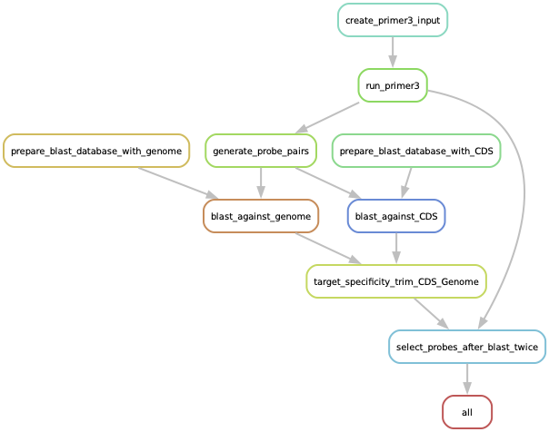
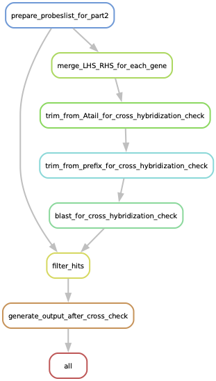

# FFPE Visium probe design with snakemake
The pipeline developed by Ireen van Dolderen (with different python scripts) has been modified by Sybil Herrera Foessel et al. to be run as a Snakemake workflow system. The entire pipeline includes 2 steps (with corresponding scripts, see respective folders), step 1 consisting of the pipeline originally developed by Ireen van Dolderen, here adapted to Snakemake, and modified to be more generalizable with only one input file for the gene of interest. Probe specificity is also checked twice against the reference genome, first against the CDS and then against the entire genome (if only one blast query is needed, please use files in step1/Step1 (one blast search CDS)). Step2 are scripts developed by Sybil Herrera Foessel that include blasting against databases to check merged sequences (trimmed from A-tail and prefix) for cross-hybridization against (env-nt, prok-nt, and viruses-nt), excluding hits with 99% similarity, and preparing the final output xlsx files for probe ordering. The config.yaml file in part2 is used to specify: 

config.yaml:
1) blast_db_dir: "/home/sybil.hf/cross_hybridization/blast_db_experimental/db" # define your blast database directory in part2
2) blast_dbs:
  - "env_nt"
  - "nt_prok"
  - "nt_viruses"

3) num_probe_pairs: 2  # Number of probe pairs to include for each sequence ID (maximum 3, as defined in part1)

Additional modifications from the original pipeline:

Parameters in the blast queries can be changed in both Snakefiles which allows for more flexibility and control:

     evalue=10, # e-value threshold, default 10
     word_size=11, #word size for alignment, default 11
     reward=1, #score for a match, default 1
     penalty=-2,  #penalty for a mismatch, default -2
     task="blastn-short" #default blastn 

##

*Figure 1: Rule Graph for part 1 (left), Rule Graph for part 2 (right)*

---

## Preparation
This pipeline has been adapted to the ST-analysis server and is run within conda/mamba environments.

1. Make a snakemake directory in ST-analysis server with your favorite name for part 1 and part 2 ($ mkdir Snakemake_env_probes_design_part1 Snakemake_env_probes_design_part2).
2. Install mamba in your base environment $ conda install mamba -n base -c conda-forge
3. Install snakemake in a close environment $ mamba create -c conda-forge -c bioconda -n snakemake snakemake
4. Activate snakemake environment $ mamba activate snakemake
5. $ snakemake --help $ snakemake --version
6. Upload all the files $ scp -r -i .ssh/name Desktop/path/*.py name@st-analysis.scilifelab.se:/home/name/path/. Use ($ *.py) ($ probes_env.yaml) ($ Snakefile_New2) needed to respective folder 'Snakemake_env_probes_design_part1' 'Snakemake_env_probes_design_part2'
7. Prepare your input file (upload $ *.xlsx to Snakemake_env_probes_design_part1)
8. Download CDS (spliced transcriptome) and genome (whole genome) fasta file of your species of interest to Snakemake_env_probes_design_part1 using `$wget [ftp://plantgenie.org:980/Data/PlantGenIE/Populus_tremula_X_Populus_tremuloides/v1.0.1/fasta/Potrx01-CDS.fa.gz](ftp://plantgenie.org:980/Data/PlantGenIE/Populus_tremula_X_Populus_tremuloides/v1.0.1/fasta/Potrx01-CDS.fa.gz)` and genome [ftp://plantgenie.org:980/Data/PlantGenIE/Populus_tremula_X_Populus_tremuloides/v1.0.1/fasta/Potrx01-genome.fa.gz]. 
9. Unzip CDS and genome fasta file using $ gunzip Potrx01-CDS.fa.gz Potrx01-genome.fa.gz 
10. Install primer3 $ conda install -c bioconda primer3
11. Install blast $ mamba install blast

## Run Snakemake
First run Snakefile in part1, the final output for this part is selected_probes.txt file, also check process_log.log file for any details (non_specific_probes, i.e. multiple hits).

1. First make a dry run to see that everything is in place $ snakemake -c 1 -s Snakefile_name --use-conda -np
2. Now run the workflow $ snakemake -c 1 --use-conda -s Snakefile_name
3. If it gets stuck $ snakemake -c 1 --use-conda -s Snakefile_name --rerun-incomplete
4. If you want to delete outputs and run again $ snakemake -s Snakefile_name --delete-all-output
5. To rerun everything after editing a script $ snakemake -c 1 -s Snakefile_name --use-conda --forceall
6. for rerunning specific rules: snakemake -c 1 -s Snakefile_name --use-conda --force --rerun-incomplete rulename
7. Check respective log file in logs/ folder if something is wrong or in the general snakemake log file.

After running part1 copy the output file to part 2 folder with, $cp selected_probes.txt nakemake_env_probes_design_part2/. Then run the snakefile for part2. Use config.yaml for selecting how many probes per sequence ID that should be printed (max3 per sequence ID). 

## Visualization of snakemake workflow
$ conda install graphviz

$ snakemake -s Snakefile_New2 --dag | dot -Tpdf > dag.pdf

$ snakemake -s Snakefile_New2 --rulegraph | dot -Tpdf > rulegraph.pdf

$ snakemake -s Snakefile_New2 --filegraph | dot -Tpdf > filegraph.pdf

**Download databased used for Cross-hybrydization check (not part of snakemake pipeline)**

Two sh files are available in step2/Download_databases_for_cross_check/ folder (these files are not included in the Snakefile). One for downloading the database for cross hybridization check and the other one example for executing blasting through slurm (this is not needed since they can be run directly on shell or using the Snakefiles). See the sh script files for more details. 

Preparation
1. Prepare a folder for cross-hybrization in st-analysis $ mkdir cross-hybridization/db
2. In step2 folder you will find the download_db.sh script, download or copy to your folder .. db/
3. Make script executable $ chmod +x download_db.sh
4. and then run it directly on your terminal (no slurm) 
./download_db.sh 
5. In step2 folder you also have script_check_cross.sh for running the blast search (this is a slurm sbatch script), copy to the same folder.
6. Run this sh file on slurm $ sbatch script_check_cross.sh, this script will generate filtered_results/filtered_results.txt

## Additional information provided by Ireen

**Criteria taken care of in primer3 run** 

- probe size = 25 nucleotides
- GC range for LHS probe = 44% - 72%
- max unknown nucleotides = 1
- maximum length of mononucleotide repeats = 5
- n probes generated per sequence = 35 (to be filtered down in later steps)

**Generate probe pairs output:** 

- preliminary list of primer pairs including:
    1. sequence ID 
    2. sequence template 
    3. probe pairs sorted based on start site, and their information: 
        1. LHS & RHS probe ID
        2. probe pair start and end site 
        3. LHS & RHS probe sequence, including handles 
        4. LHS & RHS probe GC content 
- a fasta file containing the ************************hybridising************************ all probe pairs sequences sequences pair, RHS and LHS combined (”probe_pairs_hyb_T89.fasta”)
- a fasta file for each gene containing the ************************hybridising************************ sequences for all probes, RHS and LHS separate
- a txt file for each gene containing the **********full********** probe sequences for each gene, in IDT OligoAnalyzer batch input format
- NOTE: comment out the writing functions which you do not need to avoid cluttering

**criteria taken care of:**

- LHS probe must end at T
- RHS probe must start right after the LHS probe
- RHS probe must be within GC range 44%-72%
- RHS probe must fit on the sequence template
- LHS and RHS hybridising sequences must be ligated to their corresponding probe handles
- Primer3 filters out primers likely to form hairpins.

**Off target hybridisation (BLAST)**

build a blast database using makeblastdb and blast agains reference genome (fasta file)
    - note: include `-task blastn-short` when blasting sequences < 30 nucleotides (i.e. when blasting RHS and LHS invidiually)
    - note: the output contains probe ID, sequence ID and percentage identity
    - note: with standard blast threshold (E value = 0.05), the lowest percentage identity included in the hits is 88%

**clean up blast output file using target_specificity_trim**
    1. keep only match for highest transcript variant, remove duplicate matches to the same gene different transcript variant 
    2. output “trimmed_paired_probes_target_specificity_CDS.txt” 

**Probe overlap correction- select probe pairs**

**output** 

- final probe pairs

**criteria taken care of**

- get rid of probes which have off target hybridisation
- keep probes only if the binding sites do not overlap
- if probe pairs > 3, then do not accumulate more probes
- (optional: remove sequences for which no probe pairs could be generated)

