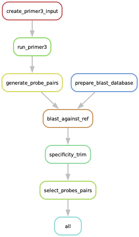
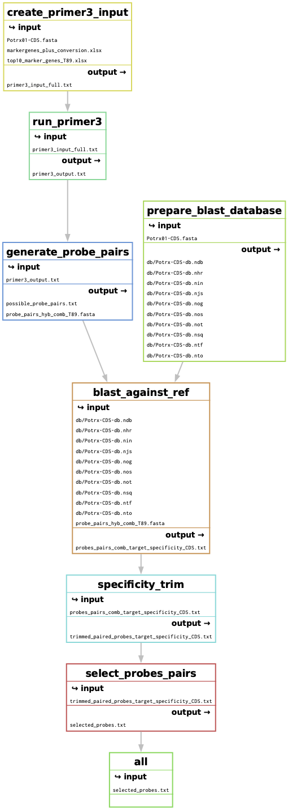

# FFPE Visium probe design with snakemake
This pipeline developed by Ireen van Dolderen (with different python scripts) has been modified by Sybil Herrera Foessel to be run as a Snakemake workflow system. In addition to the input files and the python files a Snakefile has been included as well as an probes_env.yaml file. Ireen used two input files, top10_marker_genes_T89.xlsx and markergenes_plus_conversion.xlsx, the first one with markers identified from cluster analysis and the second with markers from literature review. The top10_marker_genes_T89.xlsx can be used for pasting the new markers that you want to include in the 'gene' column and in markergenes_plus_conversion.xlsx the 'T 89' column is used by the first python script (primer3_input_design_T89.py) for extracting the entries (duplified are checked within the script).       

## Files needed

- top10_marker_genes_T89.xlsx #input file 1. 
- markergenes_plus_conversion.xlsx #Excel file with marker genes based on literature research, input file 2. 
- primer3_input_design_T89.py
- generate_probe_pairs.py
- target_specificity_trim.py
- select_probe_pairs.py
- Snakefile_New2
- probes_env.yaml

## Output files

- primer3_input_full.txt
- primer3_output.txt
- probe_pairs_hyb_T89.fasta
- possible_probe_pairs.txt
- probes_pairs_comb_target_specificity_CDS.txt
- trimmed_paired_probes_target_specificity_CDS.txt
- selected_probes.txt

### Additional output from the first python script (primer3_input_design_T89.py)

These files are generated for having better control:
num_entries_genelist_DE.txt (top10_marker_genes_T89.xlsx)
num_entries_lit_marker_df.txt (markergenes_plus_conversion.xlsx)
genelist_full.txt (list of all entries entering the pipeline)
missing_genes.txt (gene IDs from genelist_full that are missing in Potrx01-CDS.fa)
---

## Preparation

1. Make a snakemake directory in ST-analysis server with your favorite name ($ mkdir Snakemake_env_probes_design).
2. Install mamba in your base environment $ conda install mamba -n base -c conda-forge
3. Install snakemake in a close environment $ mamba create -c conda-forge -c bioconda -n snakemake snakemake
4. Activate snakemake environment $ mamba activate snakemake
5. $ snakemake --help $ snakemake --version
6. Upload all the files ($ scp -r -i .ssh/sybil Desktop/path/*.py name@st-analysis.scilifelab.se:/home/name/path/.) Use ($ *.py) ($ probes_env.yaml) ($ Snakefile_New2) needed to your folder 'Snakemake_env_probes_design'
7. Prepare your input files or use example_input (upload $ *.xlsx)
8. Download CDS (spliced transcriptome) fasta file for reference genome using `$wget [ftp://plantgenie.org:980/Data/PlantGenIE/Populus_tremula_X_Populus_tremuloides/v1.0.1/fasta/Potrx01-CDS.fa.gz](ftp://plantgenie.org:980/Data/PlantGenIE/Populus_tremula_X_Populus_tremuloides/v1.0.1/fasta/Potrx01-CDS.fa.gz)`
9. unzip CDS fasta file using `$ gunzip Potrx01-CDS.fa`
10. Install primer3 $ conda install -c bioconda primer3
11. Install blast $ mamba install blast

## Run Snakemake
1. First make a dry run to see that everything is in place $ snakemake -c 1 -s Snakefile_New2 --use-conda -n
2. Now run the workflow $ snakemake -c 1 --use-conda -s Snakefile_New2
3. If it gets stuck $ snakemake -c 1 --use-conda -s Snakefile_New2 --rerun-incomplete
4. If you want to delete outputs and run again $ snakemake --delete-all-output

## Visualization of snakemake workflow
$ snakemake -s Snakefile_New2 --dag | dot -Tpdf > dag.pdf
$ snakemake -s Snakefile_New2 --rulegraph | dot -Tpdf > rulegraph.pdf
$ snakemake -s Snakefile_New2 --filegraph | dot -Tpdf > filegraph.pdf

##  Assessing cross-probe hybridisation and final output xlsx files for ordering primers
Add Sybil, second Snakefile_New3 need to be prepared....

## Additional information provided by Ireen

**Criteria taken care of in primer3 run** 

- probe size = 25 nucleotides
- GC range for LHS probe = 44% - 72%
- max unknown nucleotides = 1
- maximum length of mononucleotide repeats = 5
- n probes generated per sequence = 35 (to be filtered down in later steps)

**Generate probe pairs output:** 

- preliminary list of primer pairs including:
    1. sequence ID 
    2. sequence template 
    3. probe pairs sorted based on start site, and their information: 
        1. LHS & RHS probe ID
        2. probe pair start and end site 
        3. LHS & RHS probe sequence, including handles 
        4. LHS & RHS probe GC content 
- a fasta file containing the ************************hybridising************************ all probe pairs sequences sequences pair, RHS and LHS combined (”probe_pairs_hyb_T89.fasta”)
- a fasta file for each gene containing the ************************hybridising************************ sequences for all probes, RHS and LHS separate
- a txt file for each gene containing the **********full********** probe sequences for each gene, in IDT OligoAnalyzer batch input format
- NOTE: comment out the writing functions which you do not need to avoid cluttering

**criteria taken care of:**

- LHS probe must end at T
- RHS probe must start right after the LHS probe
- RHS probe must be within GC range 44%-72%
- RHS probe must fit on the sequence template
- LHS and RHS hybridising sequences must be ligated to their corresponding probe handles

**Off target hybridisation (BLAST)**

build a blast database using makeblastdb and blast agains reference genome (fasta file)
    - note: include `-task blastn-short` when blasting sequences < 30 nucleotides (i.e. when blasting RHS and LHS invidiually)
    - note: the output contains probe ID, sequence ID and percentage identity
    - note: with standard blast threshold (E value = 0.05), the lowest percentage identity included in the hits is 88%

**clean up blast output file using target_specificity_trim**
    1. keep only match for highest transcript variant, remove duplicate matches to the same gene different transcript variant 
    2. output “trimmed_paired_probes_target_specificity_CDS.txt” 

**Probe overlap correction- select probe pairs**

**output** 

- final probe pairs

**criteria taken care of**

- get rid of probes which have off target hybridisation
- keep probes only if the binding sites do not overlap
- if probe pairs > 3, then do not accumulate more probes
- (optional: remove sequences for which no probe pairs could be generated)

